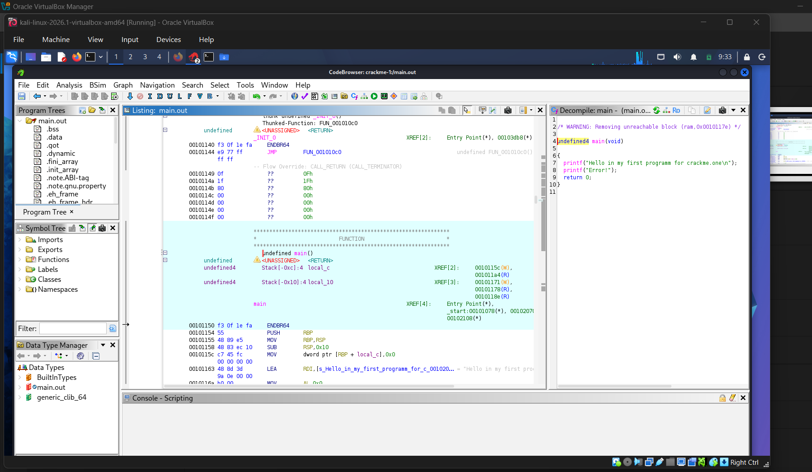

# CrackMe 01
# **Writeup Lintasan Belajar Reverse Engineering - Crackme 1**

* **Repository:** crackme-solutions
* **Target Challenge:** U Can't Pass
* **Author:** mystergaif
* **Difficulty:** 1.0 (Very Easy)
* **Platform:** Unix/Linux

---

## **1. Deskripsi Tantangan**
Tantangan ini merupakan binary eksekusi berbasis Linux bernama `main.out` yang diperoleh dari platform crackmes.one. Sesuai dengan instruksi etika akademik, proses analisis dilakukan sepenuhnya di dalam lingkungan terisolasi menggunakan mesin virtual (VirtualBox) dengan sistem operasi Kali Linux.

## **2. Ketentuan Teknis Analisis**
* **Tools RE:** Ghidra v12.1.1 (NSA Reverse Engineering Suite)
* **Environment:** Kali Linux VM (Isolated Architecture x86-64)
* **Tujuan Analisis:** Menemukan alur logika aplikasi, validasi input, kontrol alur percabangan, atau kunci/flag tersembunyi jika tersedia.

## **3. Tahapan Pembongkaran (Step-by-Step Writeup)**
### **Langkah 1: Lingkungan Kerja Terisolasi**
Sebelum melakukan pembongkaran kode, dipastikan bahwa seluruh file binary diekstrak dari arsip terenkripsi menggunakan kata sandi default `crackmes.one` di dalam direktori aman virtual machine agar tidak berinteraksi langsung dengan sistem host utama.

### **Langkah 2: Import Proyek dan Analisis Statis pada Ghidra**
File binary `main.out` dimasukkan ke dalam ruang kerja perangkat lunak Ghidra CodeBrowser. Ghidra mendeteksi secara otomatis arsitektur berkas sebagai ELF x86-64[cite: 1]. Proses analisis otomatis dijalankan untuk memetakan fungsi-fungsi dasar di dalam memori[cite: 1].

### **Langkah 3: Pelacakan Fungsi Utama (Main Function)**
Ghidra mendeteksi simbol entry point utama program, yaitu fungsi `main`[cite: 1]. Setelah melakukan dekompilasi dari bahasa rakitan (Assembly) ke bahasa tingkat tinggi yang setara dengan representasi kode C, struktur internal dari tantangan ini langsung terpetakan dengan jelas di jendela sebelah kanan perangkat lunak[cite: 1].

## **4. Dokumentasi Analisis Kode (Bukti Autentik)**
Berikut merupakan tangkapan layar lengkap proses pembedahan kode struktur `main()` di dalam Ghidra CodeBrowser:



## **5. Temuan Analisis Kode & Hasil Dekompilasi**
Berdasarkan translasi representasi visual dari jendela **Decompile: main**, struktur kode sumber aslinya adalah sebagai berikut[cite: 1]:

```c
undefined4 main(void)  
{  
    printf("Hello in my first programm for crackme.one\n");  
    printf("Error!");  
    return 0;  
}


Tantangan "U Can't Pass" ini terbukti merupakan program statis dasar yang dibuat tanpa mekanisme autentikasi proteksi kata sandi[cite: 1]. 
Alur eksekusi hanya mencetak string petunjuk awal, dilanjutkan dengan string kegagalan buatan teks Error!, kemudian keluar dari memori dengan mengembalikan status aman return 0[cite: 1]. Solusi dari tantangan pertama ini diselesaikan dengan membuktikan tidak adanya variabel rahasia tersembunyi di dalam struktur arsitektur logic aplikasi[cite: 1].

Disclaimer: Portofolio ini disusun murni untuk tujuan riset akademis, pemenuhan tugas perkuliahan, serta edukasi keamanan perangkat lunak. Seluruh analisis dilakukan di lingkungan aman VM.
