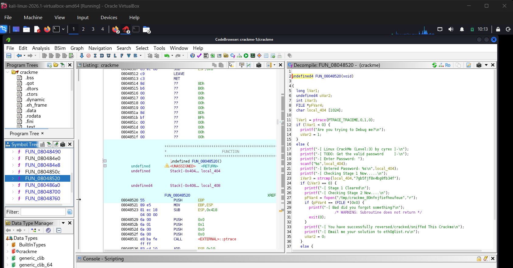
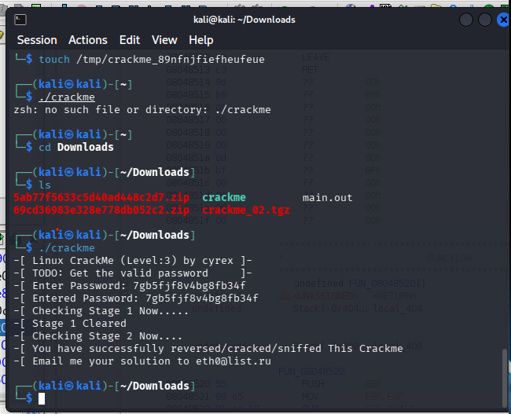

# **Writeup Lintasan Belajar Reverse Engineering - Crackme 2**

* **Repository:** crackme-solutions
* **Target Challenge:** linux_crackme_02
* **Author:** cyrex
* **Difficulty:** 1.0 (Easy)
* **Platform:** Unix/Linux

---

## **1. Deskripsi Tantangan**
Tantangan kedua ini merupakan sebuah berkas binary ELF Linux berukuran kecil (2.15 KB) yang diperoleh dari platform edukasi crackmes.one. Analisis dilakukan sepenuhnya di dalam Virtual Machine Kali Linux yang terisolasi dari host utama demi keamanan sistem.

## **2. Ketentuan Teknis Analisis**
* **Tools RE:** Ghidra v12.1.1 (NSA Reverse Engineering Suite)
* **Environment:** Kali Linux VM (Isolated Architecture x86)
* **Tujuan Analisis:** Mengidentifikasi mekanisme anti-debugging, menemukan kunci otentikasi (password) Stage 1, serta memecahkan dependensi eksternal pada Stage 2.

## **3. Tahapan Pembongkaran (Step-by-Step Writeup)**
### **Langkah 1: Penanganan File Simbol Ter-strip**
Saat binary di-import ke Ghidra CodeBrowser, ditemukan bahwa simbol fungsi nama utama (`main`) telah dihapus (*stripped*). Pelacakan dilakukan secara manual melalui fungsi `entry` bawaan kompilasi dengan menganalisis argumen pertama dari fungsi sistem `__libc_start_main`. Ditemukan fungsi utama tersembunyi dengan nama penanda objek `FUN_08048520`.

### **Langkah 2: Dekompilasi dan Analisis Logika Kode**
Setelah melakukan proses analisis statis dan dekompilasi pada fungsi `FUN_08048520`, ditemukan tiga komponen alur logika utama:
1. **Mekanisme Anti-Debugging:** Program menggunakan fungsi `ptrace(PTRACE_TRACEME, ...)` untuk menghentikan aplikasi secara prematur apabila mendeteksi adanya perangkat *active debugging engine* (seperti GDB).
2. **Validasi Password Stage 1:** Program menerima masukan pengguna dan mencocokkannya menggunakan fungsi komparasi string `strcmp`.
3. **Pemeriksaan Berkas Stage 2:** Program mencoba membuka berkas dependensi lokal pada direktori sementara Linux menggunakan `fopen`.

## **4. Dokumentasi Analisis Kode (Bukti Autentik)**
Berikut merupakan visualisasi struktur fungsi internal yang berhasil didekompilasi oleh Ghidra:

## **5. Temuan Analisis & Pemecahan Kunci Keamanan**

### **A. Kunci Otentikasi Stage 1**
Berdasarkan pembacaan mentah teks (*plain-text*) pada fungsi pembanding `strcmp`, kunci rahasia yang disimpan di dalam memori statis bernilai:

7gb5fjf8v4bg8fb34f

B. Kunci Dependensi Stage 2
Logika program mensyaratkan eksistensi berkas fisik eksternal pada alamat sistem /tmp/. Jika fungsi fopen mengembalikan nilai pointer 0x0 (NULL), eksekusi akan digagalkan otomatis. Alamat berkas jebakan tersebut adalah:
/tmp/crackme_89nfnjfiefheufeue

6. Kesimpulan dan Solusi Akhir (Proof of Work)
Tantangan diselesaikan dengan melakukan manipulasi lingkungan lokal terminal. Penuntasan dilakukan dengan membuat berkas tiruan kosong di direktori target menggunakan perintah touch /tmp/crackme_89nfnjfiefheufeue, mengeksekusi binary berkas, dan menyuplai kata sandi yang telah ditemukan.

Program berhasil ditembus dengan bukti keluaran teks sukses seperti dokumentasi di bawah ini:

Disclaimer: Portofolio ini disusun murni untuk tujuan riset akademis, pemenuhan tugas perkuliahan, serta edukasi keamanan perangkat lunak. Seluruh analisis dilakukan di lingkungan aman VM.

