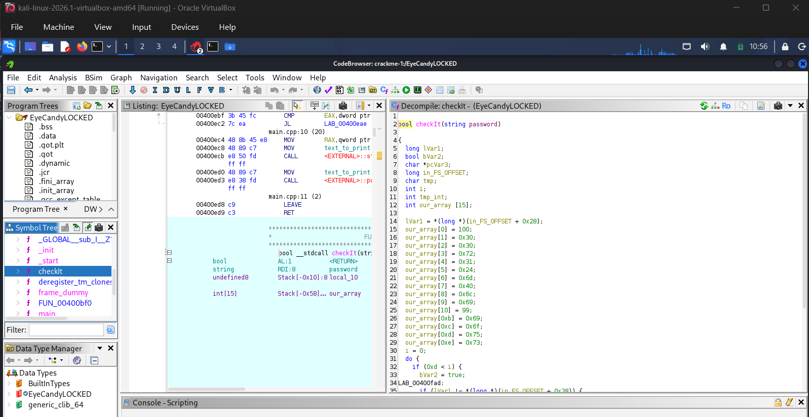
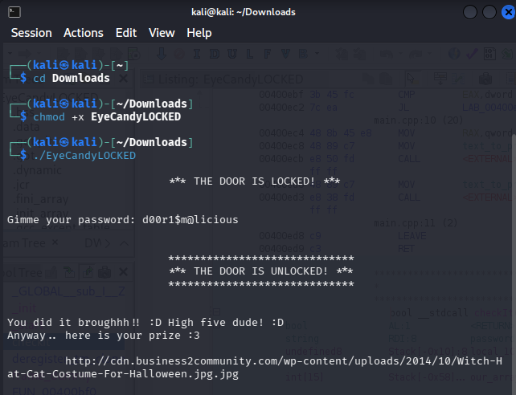

# **Writeup Lintasan Belajar Reverse Engineering - Crackme 3**

* **Repository:** crackme-solutions
* **Target Challenge:** EyeCandyLOCKED
* **Author:** nexy
* **Difficulty:** 1.5 (Easy-Medium)
* **Platform:** Unix/Linux

---

## **1. Deskripsi Tantangan**
Tantangan ketiga ini merupakan sebuah berkas binary kompilasi bahasa pemrograman C++ berarsitektur 64-bit (`x86-64`) dengan ukuran berkas sebesar 16.88 KB. Analisis dilakukan di lingkungan terisolasi menggunakan Virtual Machine Kali Linux untuk membedah proteksi internal aplikasi.

## **2. Ketentuan Teknis Analisis**
* **Tools RE:** Ghidra v12.1.1 (NSA Reverse Engineering Suite)
* **Environment:** Kali Linux VM (Isolated Architecture x86_64)
* **Tujuan Analisis:** Menganalisis alur program berbasis objek/C++, mengidentifikasi fungsi enkripsi kustom, serta melakukan konversi array ASCII untuk memecahkan password rahasia.

## **3. Tahapan Pembongkaran (Step-by-Step Writeup)**
### **Langkah 1: Identifikasi Fungsi Utama C++**
Berbeda dengan tantangan sebelumnya yang simbol fungsinya terhapus, berkas binary ini mempertahankan simbol kompilasinya (*not stripped*). Fungsi utama program langsung terdeteksi pada penanda objek `main`. Namun, pembacaan fungsi `main` menunjukkan adanya mekanisme penanganan interupsi (anti-debugging via `ptrace`) serta pengalihan validasi input ke fungsi eksternal kustom.

### **Langkah 2: Pelacakan Fungsi Validasi Kustom**
Pada baris logika utama, string input kata sandi yang dimasukkan pengguna dilempar ke sebuah fungsi validasi khusus bernama `checkIt`. Program tidak menyimpan string pembanding secara langsung (*plain-text*) di fungsi utama, melainkan menyembunyikannya di dalam memori lokal fungsi `checkIt` tersebut.

## **4. Dokumentasi Analisis Kode (Bukti Autentik)**
Berikut merupakan struktur dekompilasi fungsi internal `checkIt` yang berhasil dibongkar di dalam Ghidra CodeBrowser:

## **5. Temuan Analisis & Rekonstruksi Enkripsi Array**
Berdasarkan visualisasi kode di atas, fungsi `checkIt` menyimpan karakter kata sandi di dalam struktur array integer bernama `our_array`. Karakter disimpan menggunakan kombinasi bilangan desimal mentah dan bilangan berbasis Hexadesimal (`0x`). 

Berikut adalah tabel rekonstruksi manual hasil konversi dari data memori array menjadi karakter teks ASCII:

| Indeks Array | Nilai Asli (Memori) | Hasil Konversi ASCII |
|---|---|---|
| `our_array[0]` | `100` (Desimal) | **d** |
| `our_array[1]` | `0x30` (Hex) | **0** |
| `our_array[2]` | `0x30` (Hex) | **0** |
| `our_array[3]` | `0x72` (Hex) | **r** |
| `our_array[4]` | `0x31` (Hex) | **1** |
| `our_array[5]` | `0x24` (Hex) | **$** |
| `our_array[6]` | `0x6d` (Hex) | **m** |
| `our_array[7]` | `0x40` (Hex) | **@** |
| `our_array[8]` | `0x6c` (Hex) | **l** |
| `our_array[9]` | `0x69` (Hex) | **i** |
| `our_array[10]` | `99` (Desimal) | **c** |
| `our_array[0xb]`| `0x69` (Hex) | **i** |
| `our_array[0xc]`| `0x6f` (Hex) | **o** |
| `our_array[0xd]`| `0x75` (Hex) | **u** |
| `our_array[0xe]`| `0x73` (Hex) | **s** |

Melalui penggabungan karakter dari indeks `0` hingga `0xe`, ditemukan kata sandi otentikasi rahasia yaitu:

d00r1$m@licious

6. Kesimpulan dan Solusi Akhir (Proof of Work)
Pengujian dilakukan langsung melalui terminal Kali Linux dengan memberikan hak akses eksekusi pada berkas binary menggunakan perintah chmod +x EyeCandyLOCKED. Saat program dijalankan dan meminta input kata sandi, kode hasil rekonstruksi di atas disuplai ke dalam sistem.

Sistem berhasil ditembus dengan konfirmasi status THE DOOR IS UNLOCKED! beserta output hadiah tautan gambar eksternal seperti visualisasi di bawah ini:

Disclaimer: Portofolio ini disusun murni untuk tujuan riset akademis, pemenuhan tugas perkuliahan, serta edukasi keamanan perangkat lunak. Seluruh analisis dilakukan di lingkungan aman VM.
